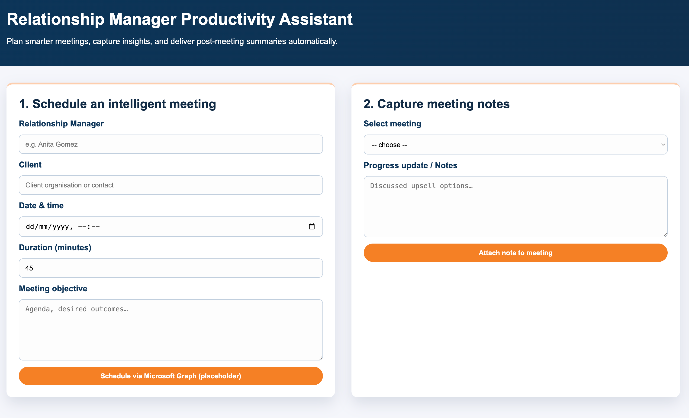
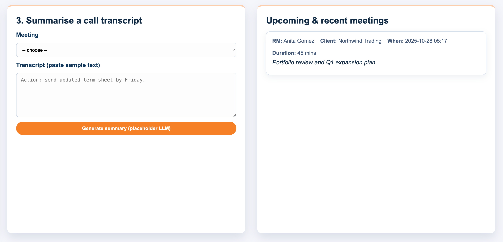
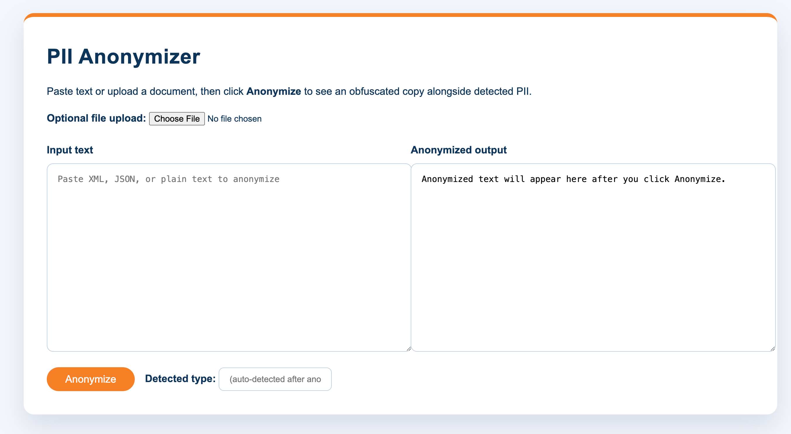

# PII Anonymization Scaffold

This repository contains:

- tooling to detect and anonymize personally identifiable information (PII) in XML, JSON, and free-form text,
- a Relationship Manager productivity demo, and
- a text summarisation workflow (currently disabled in the combined app while we rework the deployment flow).

## Repository Map

- `app.py` – Root Flask application exposing three tabs (Productivity, PII Anonymiser, Text Summariser).
- `templates/combined.html` – Branded shell with Cloudera styling that hosts each feature inside an iframe.
- `anonymization/` – Sample data, regex-enhanced NER anonymiser, and HTML template for the web front-end.
- `productivity/` – Relationship Manager productivity assistant demo and supporting services.
- `summarize/` – BART-based summarisation blueprint plus automation to register/deploy the model on CML.
- `static/cloudera-logo.svg` – Branding asset shared by the three experiences.

## Setup

1. Ensure Python 3.13 (or later) is active (`python --version`).
2. Install CPU wheels for PyTorch and Transformers:
   ```bash
   python -m pip install --user --index-url https://download.pytorch.org/whl/cpu torch
   python -m pip install --user transformers
   ```
   If you need to isolate dependencies, create a virtual environment first (`python -m venv .venv && source .venv/bin/activate`).

## Usage

Run the anonymizer from the repository root:

```bash
python anonymization/pii_anonymizer.py
```

The script will:

- download the `dslim/bert-base-NER` model (first run only),
- scan both sample data files,
- replace detected PII with placeholders like `[PERSON_1]`, `[EMAIL_2]`, `[CREDIT_CARD_1]`,
- and write anonymized versions to `anonymization/output/`.

Refer to the script logs for a mapping between original values and placeholders when auditing results.

## Customization

- To plug in different models, change `NER_MODEL` in `pii_anonymizer.py`.
- Additional regex patterns can be defined in the `PII_REGEXES` dictionary for domain-specific identifiers.
- Replace the sample data files with your own inputs to test broader scenarios; the anonymizer traverses arbitrary nested JSON and XML structures.

## Refinements

- Reorder or adjust `PII_REGEXES` so SSNs and credit cards map to `[SSN_*]` and `[CREDIT_CARD_*]` placeholders instead of the more generic phone label.
- Consider additional post-processing or custom label aggregation to merge adjacent NER spans and eliminate partial-name leftovers (e.g., `Jane Do` + trailing `e`).

## Web Application

Running `python app.py` starts a single Flask server that presents all three workflows in a tabbed interface:

1. **RM Productivity Assistant** – schedule meetings, capture notes, and attach transcript summaries.
2. **PII Anonymizer** – paste or upload content and inspect the deterministic placeholder mapping.
3. **Text Summarizer** – _temporarily unavailable in the combined UI while BART deployment issues are resolved._

You can launch the combined experience locally (`http://127.0.0.1:8080`) or from a CDSW application bound to `app.py`.

## Screenshots





## Relationship Manager Productivity Demo

The `productivity/` folder contains a companion Flask demo for bank Relationship
Managers. It illustrates how to:

- schedule client meetings using Microsoft Graph placeholders,
- capture meeting notes and progress updates, and
- generate post-meeting summaries from call transcripts (placeholder LLM).


## Text Summarisation with BART on CML _(paused)_

The summarisation feature is currently switched off in the combined web application while we stabilise the CML deployment workflow. The helper script in `summarize/register_model.py` remains in the repository so you can experiment independently; once the deployment pipeline is reliable we will re-enable the tab in `app.py`.

To manually provision the model, rely on the script below. Be aware that the UI will not surface it until the integration is reinstated:

```bash
export CML_BASE_URL="https://<workspace-host>/ml"          # CML control-plane base URL
export CML_ACCESS_TOKEN="<personal-access-token>"
export CDSW_PROJECT_ID="<target-project-uuid>"

# Optional overrides for inference requests made by the web app
export CML_MODEL_ENDPOINT="https://<workspace-host>/model-endpoint/<id>"
export CML_PROJECT_KEY="<workspace-project-key>"

python summarize/register_model.py --workload S
```

If you already have an artifact, pass `--artifact /path/to/archive.tar.gz`. Without it, the script assembles a lightweight package that downloads `facebook/bart-large-cnn` at inference time and exposes a `predict(text)` entrypoint. Successful deployment returns the model deployment metadata; record the serving URL as `CML_MODEL_ENDPOINT` so the Flask app can route requests.

The helper first attempts to use the official `cmlapi` client (matching the notebook workflow of creating a model → build → deployment). When the client or credentials are unavailable it automatically falls back to the raw REST calls above, packaging a lightweight archive on the fly. You can inspect or customise the serving entrypoint in `summarize/model/predict.py` before deploying.

Once the endpoint is live you can interact with it via the CLI helpers; the tab will return in a future update when the deployment workflow is fully automated again.
